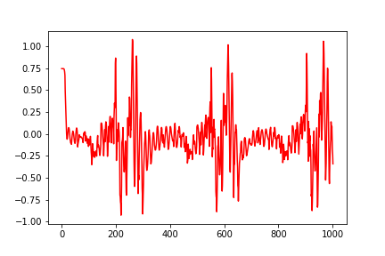

# MPC Project

In this project Model predictive control (MPC) is used to drive the car around the track, there's a 100 millisecond latency between actuations commands on top of the connection latency.

The goals / steps of this project are the following:

* Step 1: converting the map's coordinate system to the car's coordinate system for easier CTE and Epsi calculation
* Step 2: fitting a 3rd order polynomial to the converted x and y coordinates
* Step 3: using coefficients to predict car's state (px,py,psi, v) at t+dt (considering latency) 
* Step 4: feeding states to the model to solve and optimize the costs and thereby calculate the state and actuator values at t+1
* Step 5: adjusting throttle & steering values based on predictions

## Vehicle Model
<a href="https://www.codecogs.com/eqnedit.php?latex=x_{t&plus;1}&space;=&space;x_{t}&space;&plus;&space;v_{t}&space;*&space;cos(\psi_{t})&space;*&space;d_{t}\par&space;y_{t&plus;1}&space;=&space;y_{t}&space;&plus;&space;v_{t}&space;*&space;sin(\psi_{t})&space;*&space;d_{t}\par&space;v_{t&plus;1}&space;=&space;v_{t}&space;&plus;&space;a_{t}&space;*&space;d_{t}\par&space;\psi_{t&plus;1}&space;=&space;\psi_{t}&space;-&space;(v_{t}/L_{f})&space;*&space;\delta_{t}&space;*&space;d_{t}\par&space;cte_{t&plus;1}&space;=&space;f(x_{t})&space;-&space;y_{t}&space;&plus;&space;v_{t}&space;*&space;sin(e\psi_{t})&space;*&space;d_{t}\par&space;e\psi_{t&plus;1}&space;=&space;\psi_{t}&space;-&space;d\psi_{t}&space;&plus;&space;(v_{t}/L_{f})&space;*&space;\delta_{t}&space;*&space;d_{t}\par" target="_blank"></a>

## Actuator Constraints

Vehicle can't have steering angle of 90 degrees, such conditions can be fixed by setting a lower and upper bound for actuators:

<a href="https://www.codecogs.com/eqnedit.php?latex=\delta&space;\in&space;[-25^{\circ},&space;25^{\circ}]\par&space;a&space;\in&space;[-1,&space;&plus;1]" target="_blank"></a>

## Prediction Horizon

The prediction horizon is the duration over which future predictions are made. 

N dt are the hyperparameters to tune for each model predictive controller. The general guidelines is to have N as large as possible, while dt should be as small as possible.

I tested my model with dt= 0.01 and N=5, which was not enough input for the model to control the vehicle. I then increased dt to 0.05 and N to 10 which significanlty improved my model.

For dealing with latency, I used coefficients to predict car's state (px,py,psi, v) at t+dt (dt=0.05) before passing it to the model. 

## Optimizing cost

Model's goal is to minimize errors:
 * cte: distance of vehicle from trajectory
 * epsi: difference of vehicle orientation and trajectory

This model also considers additional costs to penalize vehicle:
 * for not maintaining the reference velocity (75mph)
 * control-input magnitude & change rate  as well as th3e differences from the next control-input state

However I added more weights to some of the costs to add more penalty to the model for a smoother driving:

<a href="https://www.codecogs.com/eqnedit.php?latex=i&space;\in&space;[0:N]\par&space;cost_{i}&space;=&space;20*cte_{i}^{2}\par&space;cost_{i}&space;&plus;=&space;e\psi_{i}^{2}\par&space;cost_{i}&space;&plus;=&space;(v_{i}-v_{ref})^{2}\par" target="_blank"></a>

<a href="https://www.codecogs.com/eqnedit.php?latex=i&space;\in&space;[0:N-1]\par&space;cost_{i}&space;&plus;=&space;200&space;*&space;\delta_{t}^{2}\par&space;cost_{i}&space;&plus;=&space;20&space;*&space;a_{t}^{2}\par" target="_blank"></a>

<a href="https://www.codecogs.com/eqnedit.php?latex=i&space;\in&space;[0:N-2]\par&space;cost_{i}&space;&plus;=&space;2000&space;*&space;(\delta_{t&plus;1}&space;-&space;\delta_{t})^{2}\par&space;cost_{}&space;&plus;=&space;20&space;*&space;(a_{t&plus;1}&space;-&space;a_{t})^{2}\par" target="_blank"></a>

Here are the cte, v & steering_angle diagrams that I collected for 1000 iterations, as depicted below majority of cte-values are around 0 which shows model is trying to stay in track, & valocity is maintaining 50mph, steering-angle-values are very similar to cte-values that's most likely happening in the curbs when there's a sharp change in keeping the vehicle in track :
<table style="width:100%">
  <tr>
    <td>CTE</td>
    <td>Velocity</td>
    <td>Steering Anlge</td>
  </tr>
  <tr>
    <td></td>
    <td></td>
    <td></td>
  </tr>
  <tr>
<table>
---

## Dependencies

* cmake >= 3.5
 * All OSes: [click here for installation instructions](https://cmake.org/install/)
* make >= 4.1
  * Linux: make is installed by default on most Linux distros
  * Mac: [install Xcode command line tools to get make](https://developer.apple.com/xcode/features/)
  * Windows: [Click here for installation instructions](http://gnuwin32.sourceforge.net/packages/make.htm)
* gcc/g++ >= 5.4
  * Linux: gcc / g++ is installed by default on most Linux distros
  * Mac: same deal as make - [install Xcode command line tools]((https://developer.apple.com/xcode/features/)
  * Windows: recommend using [MinGW](http://www.mingw.org/)
* [uWebSockets](https://github.com/uWebSockets/uWebSockets)
  * Run either `install-mac.sh` or `install-ubuntu.sh`.
  * If you install from source, checkout to commit `e94b6e1`, i.e.
    ```
    git clone https://github.com/uWebSockets/uWebSockets 
    cd uWebSockets
    git checkout e94b6e1
    ```
    Some function signatures have changed in v0.14.x. See [this PR](https://github.com/udacity/CarND-MPC-Project/pull/3) for more details.
* Fortran Compiler
  * Mac: `brew install gcc` (might not be required)
  * Linux: `sudo apt-get install gfortran`. Additionall you have also have to install gcc and g++, `sudo apt-get install gcc g++`. Look in [this Dockerfile](https://github.com/udacity/CarND-MPC-Quizzes/blob/master/Dockerfile) for more info.
* [Ipopt](https://projects.coin-or.org/Ipopt)
  * Mac: `brew install ipopt`
       +  Some Mac users have experienced the following error:
       ```
       Listening to port 4567
       Connected!!!
       mpc(4561,0x7ffff1eed3c0) malloc: *** error for object 0x7f911e007600: incorrect checksum for freed object
       - object was probably modified after being freed.
       *** set a breakpoint in malloc_error_break to debug
       ```
       This error has been resolved by updrading ipopt with
       ```brew upgrade ipopt --with-openblas```
       per this [forum post](https://discussions.udacity.com/t/incorrect-checksum-for-freed-object/313433/19).
  * Linux
    * You will need a version of Ipopt 3.12.1 or higher. The version available through `apt-get` is 3.11.x. If you can get that version to work great but if not there's a script `install_ipopt.sh` that will install Ipopt. You just need to download the source from the Ipopt [releases page](https://www.coin-or.org/download/source/Ipopt/).
    * Then call `install_ipopt.sh` with the source directory as the first argument, ex: `sudo bash install_ipopt.sh Ipopt-3.12.1`. 
  * Windows: TODO. If you can use the Linux subsystem and follow the Linux instructions.
* [CppAD](https://www.coin-or.org/CppAD/)
  * Mac: `brew install cppad`
  * Linux `sudo apt-get install cppad` or equivalent.
  * Windows: TODO. If you can use the Linux subsystem and follow the Linux instructions.
* [Eigen](http://eigen.tuxfamily.org/index.php?title=Main_Page). This is already part of the repo so you shouldn't have to worry about it.
* Simulator. You can download these from the [releases tab](https://github.com/udacity/self-driving-car-sim/releases).
* Not a dependency but read the [DATA.md](./DATA.md) for a description of the data sent back from the simulator.


## Basic Build Instructions


1. Clone this repo.
2. Make a build directory: `mkdir build && cd build`
3. Compile: `cmake .. && make`
4. Run it: `./mpc`.

